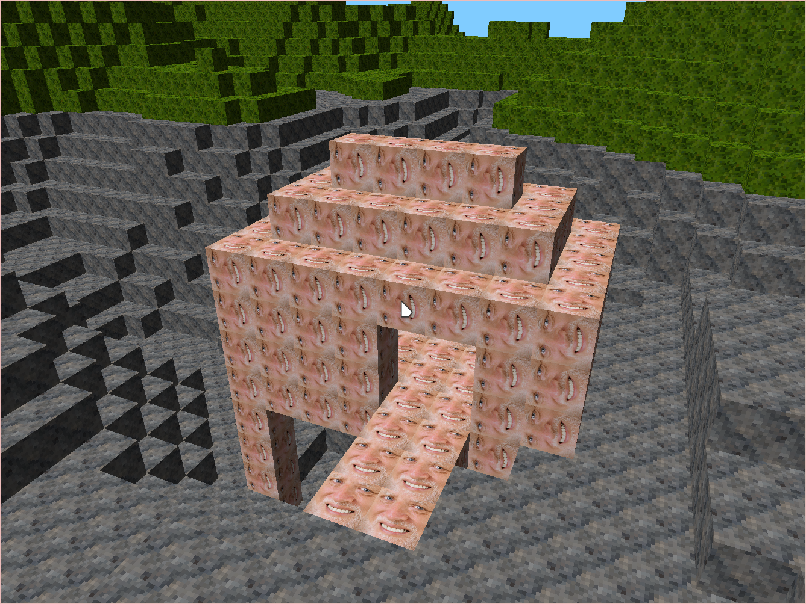

# unsafe {}

A minecraft clone made in Rust.

## HEAVY WIP

there is no:

 * ~~placement of blocks~~
 * world saving
 * actual gameplay

This is how it looks so far:




## How to play the game

Starting the game is very simple:

```
cargo run -r
```

Remember to use the release build (with the `-r` flag), otherwise it will be slow and laggy.

Then you can use the following keys:

 * WASD - movement
 * space - move up
 * ctrl - move down
 * Q - destroy block
 * E - place harold

good luck!
