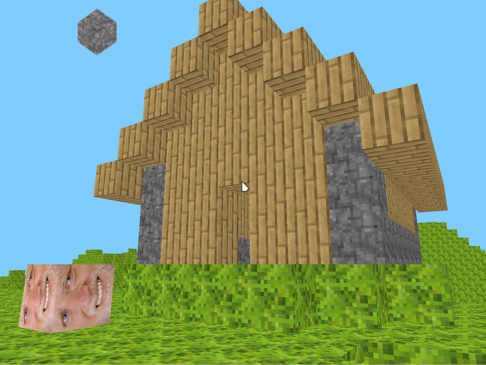

# unsafe {}

A minecraft clone made in Rust. The world is infinite in all three directions.

**DISCLAIMER**: Some textures are stolen from the [chisel mod](https://github.com/Chisel-Team/Chisel)

## HEAVY WIP

there is no:

 * ~~placement of blocks~~
 * ~~world saving~~ (okay now there is some basic saving)
 * actual gameplay (there is harold tho)

This is how it looks so far:



## How to play the game

Starting the game is very simple:

```
cargo run -r
```

Remember to use the release build (with the `-r` flag), otherwise it will be slow and laggy.

Then you can use the following keys:

 * WASD - movement
 * space - move up
 * ctrl - move down
 * Q - destroy block
 * E - place harold
 * NUMBER KEYS - change block type

 * Left mouse button - place blocks
 * Right mouse button - destroy blocks

## World saving

The `save` directory will automatically be created. It contains a separate file
for every chunk (yeah it's bad, I know).

## Good luck!
